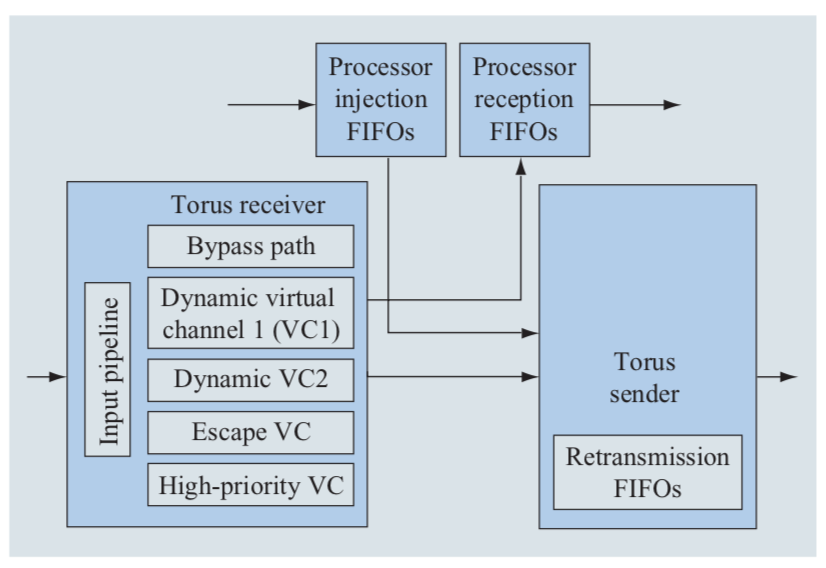

% Blue Gene/L torus interconnection network
% Kevin Hernández Rostrán
% 20 de Junio, 2020

# ¿Qué es una red de interconexión “Torus”?

La interconexión *“Torus”* es una topología sin-switch que puede verse como una interconexión de malla con:

- Nodos dispuestos en una matriz rectilínea de 2, 3 o más dimensiones.

- Procesadores conectados a sus vecinos más cercanos y procesadores correspondientes en los bordes opuestos de la matriz conectada.

# ¿Qué es una red de interconexión “Torus”? —cont.

- Las redes “Torus” se utilizan con frecuencia en supercomputadoras de alto rendimiento. 

- En la mayoría de arquitecturas los nodos de cómputo intercambian datos con sus vecinos más cercanos.

# La red Blue Gene/L

- En **Blue Gene/L** (*BG/L*), la interconexión principal para la mensajería punto a punto es una *red **“Torus”** tridimensional (3D) con enrutamiento virtual dinámico de corte*.

- El enrutador de la red torus dirige paquetes de tamaño variable, cada nx32 bytes, donde n = 1 a 8 “fragmentos”. 

# La red Blue Gene/L —cont.

- Los mensajes, como los que se ajustan a la interfaz “Message Passing Interface Standard” (MPI), pueden consistir en muchos paquetes que se construyen, envían y reciben por software que se ejecuta en uno o ambos procesadores BG/L asociados.

# La red Blue Gene/L —cont.

- Los primeros ocho bytes de cada paquete contienen:
  - Información de protocolo de “link-level” (por ejemplo, número de secuencia).
  - Información de enrutamiento, incluyendo el destino.
  - Información del canal virtual y del tamaño.
  - Y una comprobación de redundancia cíclica —“cyclic redundancy check”— (CRC) de bytes[^1]. 
  
[^1]: Esta detecta la corrupción de datos del encabezado durante la transmisión.

# La red Blue Gene/L —cont.

El protocolo de detección y recuperación de errores es similar al utilizado en las redes de interconexión de el IBM High Performance Switch (HPS) y en el estándar HIPPI-6400[^2].

[^2]: ver https://tools.ietf.org/html/rfc2835

# Estrutura general de un router “Torus”

{ width=250px } 

# Estrutura general de un router “Torus” —cont.

La lógica de torus consta de tres unidades principales:

- **Interfaz del procesador**. Consta de colas FIFO de inyección y recepción en red. Las colas se dividen en grupos:
  
  - Dos colas de alta prioridad (para mensajes del sistema operativo intre-nodo).
  - Seis colas FIFO de prioridad normal.
  
  que son suficientes para la conectividad del vecino más cercano.

# Estrutura general de un router “Torus” —cont.

- **Unidad de recepción**. Acá también hay grupos de FIFO, cada grupo contiene siete FIFO, uno de alta prioridad y uno dedicado a cada una de las direcciones entrantes.

# Estrutura general de un router “Torus” —cont.

- **Unidad de envío**. Se encarga de la comunicación de su nodo adjunto.

# Estrutura general de un router “Torus” —cont.

Para el enrutamiento de los datos cada uno de los receptores se compone de una tubería de entrada de ocho etapas, cuatro canales virtuales (VC) y un canal de derivación.