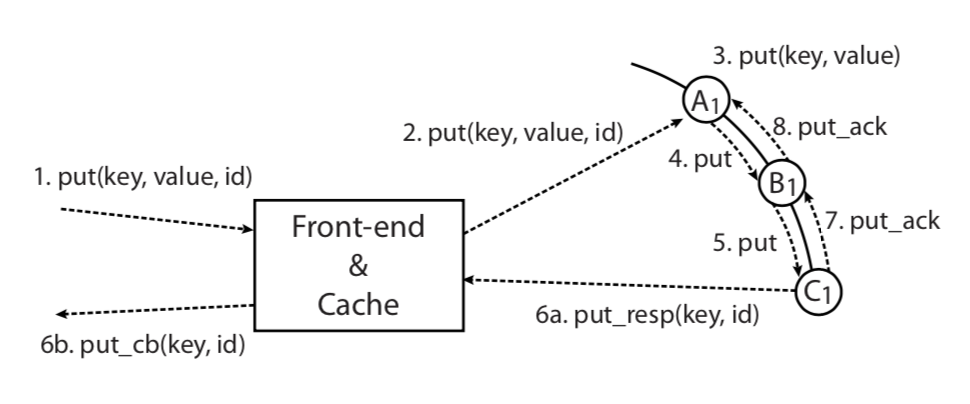

% FAWN: A Fast Array of Wimpy Nodes
% Kevin Hernández Rostrán
% 20 de Junio, 2020

# ¿Qué es FAWN?

Arquitectura de clúster para computación de datos intensiva y de **bajo consumo de energía** que combina nodos integrados de baja potencia con **almacenamiento flash** para proporcionar un procesamiento **rápido** y **energéticamente eficiente** de cargas de trabajo aleatorias e intensivas en lectura.

# Tendencias fundamentales

- Utilizar procesadores de E/S débiles —*“wimpy”*— para minimizar la brecha que existe en los CPU convencionales.

- Utilizan 1⁄3 de la frecuencia para ejecutar más de mil millones de instrucciones por Joule.

# Arquitectura FAWN-KV

{ width=250px }  

# Arquitectura FAWN-KV —cont.

**FAWN-DS**. Está diseñado específicamente para funcionar bien con el almacenamiento flash y para operar dentro de la DRAM restringida disponible en nodos débiles *“wimpy”*. Utiliza un índice de hash en memoria (DRAM) para asignar llaves de 160 bits a un valor almacenado en el registro de datos. Soporta operaciones *“Store”*, *“Lookup”* y *“Delete”*.

# Arquitectura FAWN-KV —cont.

**FAWN-KV**. Las aplicaciones cliente envían solicitudes a los *front-end* utilizando una interfaz estándar de *“put/get”*. Los *front-end* envían la solicitud al nodo de *back-end* que posee la llave del espacio para la solicitud. El nodo de *back-end* satisface la solicitud utilizando su **FAWN-DS** y responde a los servicios de *back-end*.

# Arquitectura FAWN-KV —cont.

{ width=250px }  

# Arquitectura FAWN-KV —cont.

- Las solicitudes de los clientes ingresan al sistema en uno de los varios *front-end*.

- Los nodos *front-end* envían la solicitud al nodo **FAWN-KV** —sistema de llave-valor *“key-value”*— *back-end* responsable de servir esa llave en particular.

# Arquitectura FAWN-KV —cont.

- El nodo *back-end* atiende la solicitud de su almacén de datos **FAWN-DS** y devuelve el resultado al *front-end* (que a su vez responde al cliente).

- Las escrituras proceden de manera similar.

# Replicación y consistencia

- FAWN-KV utiliza la replicación en cadena para proporcionar una fuerte consistencia por llave.

- Las actualizaciones se envían a la cabeza de la cadena, se pasan a cada miembro de la cadena a través de una conexión TCP entre los nodos, y las consultas se envían a la cola de la cadena.

# Replicación y consistencia —cont.

### Ciclo de vida de una operación *“put”* con replicación de cadena

  - El front-end dirige la operación *“put”* al sucesor de la llave, A1, que es el *“head”* de la cadena de réplicas para este rango. 

  - Después de almacenar el valor en su almacén de datos, A1 reenvía esta solicitud a B1, que almacena el valor de manera similar y reenvía la solicitud a la cola, C1. 

  - Después de almacenar el valor, C1 envía la respuesta *“put”* al front-end y envía un acuse de recibo de la cadena indicando que la respuesta se manejó correctamente.

# Replicación y consistencia —cont.

{ width=250px }  